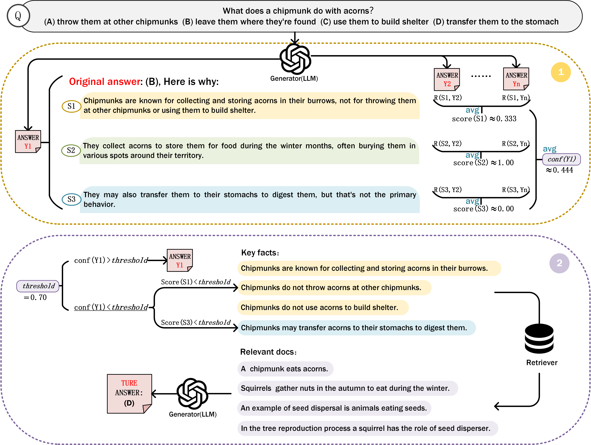

# DRGO: Dynamic Retrieval and Generation Optimization Based on Fine-Grained Confidence Evaluation

##  Table of Contents

- [ Introduction](#-introduction)
- [ Key Features](#-key-features)
- [ Project Structure](#-project-structure)
- [ Installation](#-installation)
- [ DRGO Configuration Guide](#-drgo-configuration-guide)
  - [ Main Configuration: `configs/DRGO.yaml`](#-main-configuration-configsdrgoyaml)
  - [ Benchmark Configurations: `configs/benchmark/*.yaml`](#-benchmark-configurations-configsbenchmarkyaml)
  - [ How to Run a Different Benchmark](#-how-to-run-a-different-benchmark)
  - [ Available Configuration Options](#️-available-configuration-options)
- [ Input & Output](#-input--output)
- [ Benchmarks](#-benchmarks)
- [ Reproducibility Notes](#-reproducibility-notes)



##  Introduction

**DRGO** (Dynamic Retrieval and Generation Optimization) is a novel method for optimizing retrieval-augmented generation (RAG) systems. It dynamically determines the necessity of retrieval based on **fine-grained (sentence-level) confidence estimation**, reducing unnecessary retrievals and improving efficiency and output reliability.

This repository provides the full implementation of DRGO, along with scripts and configuration for evaluating its performance on multiple QA and fact-checking benchmarks.

##  Key Features

*  **Dynamic Retrieval Decision**: DRGO uses multi-sample decoding to quantify sentence-level confidence, determining whether retrieval is required for each unit.
*  **Sentence-Level Granularity**: Baseline answers are decomposed into atomic sentence units for precision control.
*  **Fact-Guided Retrieval**: Low-confidence sentences trigger a retrieval step that extracts factual cues to guide targeted search.
*  **Multi-Dataset Evaluation**: Evaluated on ARC, CommonsenseQA, PIQA, OpenBookQA, and FEVER.
*  **Modular and Extensible**: Built with Hydra and Hugging Face Transformers for easy configuration and extensibility.

##  Project Structure

```
DRGO/
├── data/                  # Preprocessed datasets, corpus and vectorstorage
├── configs/               # Hydra configs for tasks/models
│   ├── benchmark/
│   │    ├── ARC_C.yaml
│   │    ├── ARC_E.yaml
│   │    ├── CommonsenseQA.yaml
│   │    ├── FEVER.yaml
│   │    ├── OpenBookQA.yaml
│   │    └── PIQA.yaml
│   └── DRGO.yaml
├── DRGO.py                # Entry point for running experiments
├── utils/                   
├── requirements.txt
└── README.md
```

##  Installation

Clone the repository and install dependencies:

```bash
conda create -n drgo python=3.9
conda activate drgo
git clone https://github.com/ZIQIYSU/DRGO.git
cd DRGO
pip install -r requirements.txt
```

#   DRGO Configuration Guide

This guide explains how to configure and customize DRGO experiments by modifying the YAML files under the `configs/` directory. DRGO uses [Hydra](https://hydra.cc) for managing modular configurations.

---

##  Main Configuration: `configs/DRGO.yaml`

This is the **main configuration file**. It sets the overall behavior of DRGO, such as which benchmark to run, the confidence threshold, and which base language model to use.

### Example:

```yaml
name: DRGO

retriever_path: 'model/BAAI/bge-large-en'
save_path: 'results'

llm: 'llama3'             # Set your base model (e.g., llama3, gpt-3.5-turbo)
threshold: 0.            # Confidence threshold for retrieval triggering

defaults:
  - benchmark: OpenBookQA  # Load dataset-specific config from benchmark folder

hydra:
  output_subdir: null
  run:
    dir: .
```

---

##  Benchmark Configurations: `configs/benchmark/*.yaml`

Each benchmark (e.g., ARC, CommonsenseQA, FEVER) has its own YAML config file that defines dataset paths and retrieval resources.

### Example: `configs/benchmark/ARC_C.yaml`

```yaml
name: ARC_C

dataset:
  data_path: 'data/ARC/ARC-C/validation.jsonl'  # Input data file

retriever: 'model/BAAI/bge-large-en'
vector_storage: 'data/vector_storage/arc.npy'   # Pre-built Numpy index
corpus: 'data/corpus/ARC_Corpus.txt'            # Full corpus for retrieval
sample_size: 3                                   # Number of generations per question
```

---

## 🔧 How to Run a Different Benchmark

1. Open `configs/DRGO.yaml`
2. Change the `defaults` section to point to the desired benchmark file, e.g.:

```yaml
defaults:
  - benchmark: FEVER
```

3. (Optional) Modify other fields like `llm`, `threshold`, or `save_path`.

Then run the script:

```bash
python DRGO.py
```

---

##  Available Configuration Options

| Field            | Location          | Description                                         |
| ---------------- | ----------------- | --------------------------------------------------- |
| `llm`            | DRGO.yaml         | Backbone LLM used for generation                    |
| `threshold`      | DRGO.yaml         | Confidence score threshold to trigger retrieval     |
| `sample_size`    | benchmark/\*.yaml | Number of generation samples to estimate confidence |
| `retriever`      | benchmark/\*.yaml | Sentence embedding model path                       |
| `vector_storage` | benchmark/\*.yaml | Path to precomputed vector index                    |
| `corpus`         | benchmark/\*.yaml | Text corpus used for document retrieval             |
| `data_path`      | benchmark/\*.yaml | Input dataset (validation/test set)                 |

---

##  Notes

* No command-line overrides are required. All configurations are loaded via Hydra YAML files.
* Output results will be saved to the `save_path` directory.
* Make sure the vector storage and corpus match the dataset you're evaluating.

---

For further customization (e.g., new benchmarks or evaluation metrics), extend the configs or add new ones in `configs/benchmark/`.

##  Input & Output

* **Input**: QA datasets in JSON format, optionally with ground-truth answers.
* **Output**:

  * Model predictions with/without retrieval.
  * Confidence scores per sentence.
  * Evaluation metrics (accuracy, precision, recall, etc.).
  * Logs and optional intermediate retrieval evidence.

##  Benchmarks

DRGO is evaluated on the following datasets:

* [ARC (AI2 Reasoning Challenge)](https://allenai.org/data/arc)
* [CommonsenseQA](https://www.tau-nlp.org/commonsenseqa)
* [PIQA](https://yonatanbisk.com/piqa/)
* [OpenBookQA](https://allenai.org/data/open-book-qa)
* [FEVER](https://fever.ai)

The results demonstrate that DRGO achieves a significant reduction in unnecessary retrievals while maintaining or improving final task accuracy.


##  Reproducibility Notes

* All experimental settings are controlled via `configs/` using Hydra.
* Random seeds and decoding parameters can be explicitly set via command line.
